### 1. Project name: Learning React

### 2. Period : 4 day

### 3. What is React

- `React` is one of libraries with javascript using components. `React` is developed to creat UI(User Interface) and operate callback functions per event easily. `React` is launched in 2013 and the popularity increases rapidly from developers. `React` is used at not only facebook but also other big companies such as uber, netflix, instagram. Most of web application maybe are created with `React`. In case of complicated web application, ususally use MVC pattern. MVC is one of design patterns and application could be defined as model, view, controller. `React` could be classified to veiw layer.

#### 3-1. Difference between framework and library

- In case of framework, it takes a long time to learn framework and developer could learn once again when framework has some of large changes with new concept. In contrast, in case of library, developer could build up function freely because library has not fixed structure such as framework. So, developer could learn library more fun and more easily than framework.

#### 3-2. good things regarding React

- `React` is compatible with previous version when it has new revision. Since huge community was already formed, `React` has updated well-arranged documents continueously. There is possibility that other developers already solved the problem and shared their solution when you face the problem. In addtion, the developer could creat a variety of applications with `React`. In case of using `React`, web application could be created. In case of `React Native`, mobile application could be created. In case of using `React` and `Electron`, desktop application could be created.

- Components have `state()` and `render()`. `state()` contains objects of data. `render()` defines how to display somethings to user. Classified components should be reused and independent. The components of `React` has virtual DOM Tree. In case some of child components are called by `render()` because current component has changes, `React` compares between virtual DOM Tree on his own and previous DOM Tree on browser at first and updates necessary changes at DOM Tree on browser. So, speed of operating application is not slow even though many components are called on virtual DOM Tree.

- 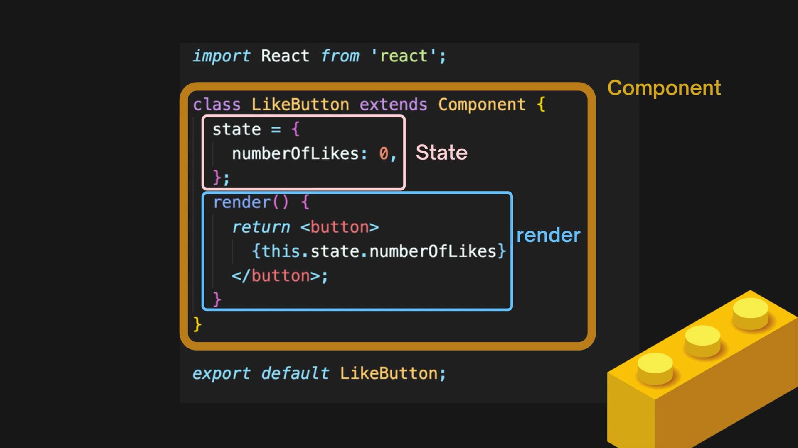
  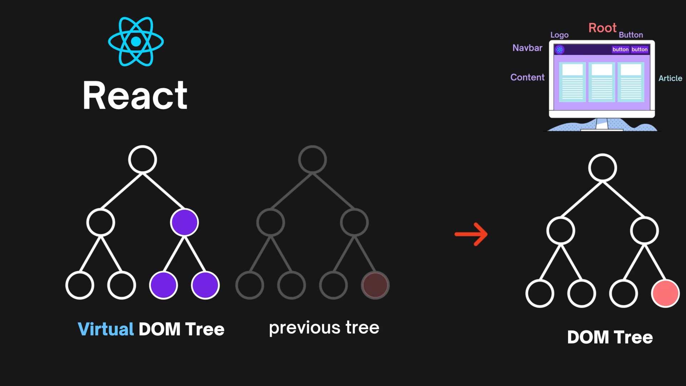

#### 3-3. Components with class and function

- `state()` is vessel that can hold datas of state. It seems like `constructor()` of class on `javascript`. Updated data should be displayed to user with `render()` when changed `state()`. In case of defined functions on `React`, `lifecycle method` could be used to call the functions on his own when events. The event contains to update/finish DOM Tree and render.

- `React` is components. The components could be created with `class` and `function`. In case of `class`, components could be extended to append their property to other child component. In case of `function`, components could be used when not only any data is not related to state() but also there is on static condition. The designers have had difficulty to cooperate with developers using `React` because principle of `class` was so difficult to the designers. `React hook` was launched on 16.8 version of `React` to improve designer's difficulty and increase work efficiency. In case of `React hook`, components could use state() when dynamic condition such as class. However, the launch date was on 6th Jan in 2019. The prior projects already was created with `class` of `React`. So, developer should learn `React hook`, `class` and have ability to creat project with both of them.

- 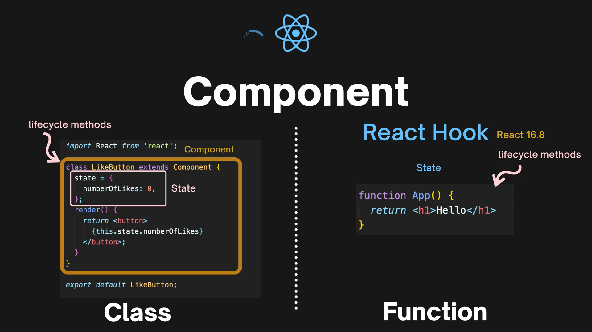

### 4. Programs needed to operate React

#### 4-1. Node.js

- Javascript runtime environment(framework) that executes javascript code outside a web browser. Thanks to `node.js`, javascript could be operated on everywhere. In addition, `node.js` would be used not only to creat back-end server but also to update server-side rendering.

#### 4-2. npm and yarn

- `npm` means program of package manager that could download and update libraries. The developer could install, uninstall and update libraries with `package.json`. `package.json` includes information of libraries such as version, scripts, and so on.

- `yarn` is also program of package manager. It was launched to resolve some of npm's shortcomings. `yarn` is faster, higher performance, more secure than `npm`. In addition, `yarn` operates on `npm` protocol with `package.json`.

- In case of `npm`, type `npm create react-app <folder name>` on current node. And then, move to folder name and `npm start` to operate `React`. In case of `yarn`, type `yarn global add create-react-app` and `create-react-app <folder name>` on current node. And then, move to folder name and `yarn start` to operate `React`.

- To apply fontawesome to `React`, library should be installed on local. In case of `npm`, use `npm install --save @fortawesome/fontawesome-free`. In case of `yarn`, use `yarn add @fortawesome/fontawesome-free`. And then, add import on `index.jsx`. In case of between `npm` and `yarn`, use `import '@fortawesome/fontawesome-free/js/all.js'`.

### 5. React basic

#### 5-1. Difference of React

- There are 4 differences as below.
  1. Javascript code that includes tags formed HTML. To highlight react component file, use extension of file as `.jsx` instead of `.js`.
  2. Code block '{}' should be covered between tags to display values of not only variable but also array. In case value is undefined, `React` can not display output related to undefined. In case of adding conditional operator `&&`, code block '{}' is also covered. The variable and `&&` would be displayed on window tab itself if not code block '{}'.
  3. Use `<React.Frangment></React.Fragment>` to use binary nodes at the same time instead of `

`. `<></>` is also same as `<React.Frangment></React.Fragment>`. There would be `module build failed` if you do not use `<React.Frangment></React.Fragment>`.
  4. keyword `return()` should be typed within function to display values on window tab.

#### 5-2. Connection with React-DOM

- Browser can understand `HTML`, `CSS`, `vanilla javascript` except for `React`. So, `React` should be translated to `vanilla javascript` with `Babel`. `React-DOM` makes `HTML` connected with translated `vanilla javascript` for browser's good understanding. So, browser can display output on window tab according to connection `element of root` with `components` using `React-DOM`. `element of root` is `HTML`. `components` contains `HTML` and `javascript`. `javascript` could be translated to `vanilla javascript` using `Babel`.

#### 5-3. Connection with files

- In case you want to use class from other component file connecting these files, please use `return <tag></tag>;`. For example, use `return <Habit></Habit>;` within App() on `app.jsx` to use class named `Habit` from `habit.jsx`. `return <Habit></Habit>` is equal to `return <Habit />`. In case you use vecode, import should be created automatically.

#### 5-4. chrome developer tool

- chrome browser offers components tab which user could check structure of elements among components such as elements tab. This would help user understand relationship between components of `React`. Please install `react developer tools` and set up default browser as chrome.

### 6. Commands

#### 6-1. On Terminal

- ctrl + c: come back to terminal after finishing the rendering of React.

- cp -R `A folder` `B foler`: creat `B folder` and copy `A folder` to `B folder`.

#### 6-2. On visual studio code

- rcc + Tab: basic component structure is created if you install `Reactjs code snippets` from extension marketplace.

- ctrl + p: current display could be moved to where you want with typing keyword simply.

### 7. Habit Tracker

#### 7-1. Concept of Habit Tracker

- Type habit name on input tab and then output should be displayed on window tab when entering or clicking add button. The list of habits are displayed on window tab with habit name, count, plus/minus buttons, transh icon. The counter should be changed when clicking plus/minus buttons. The one of list could be deleted when clicking trash icon. In addtion, in case you want to clean all lists, click reset all button.

- 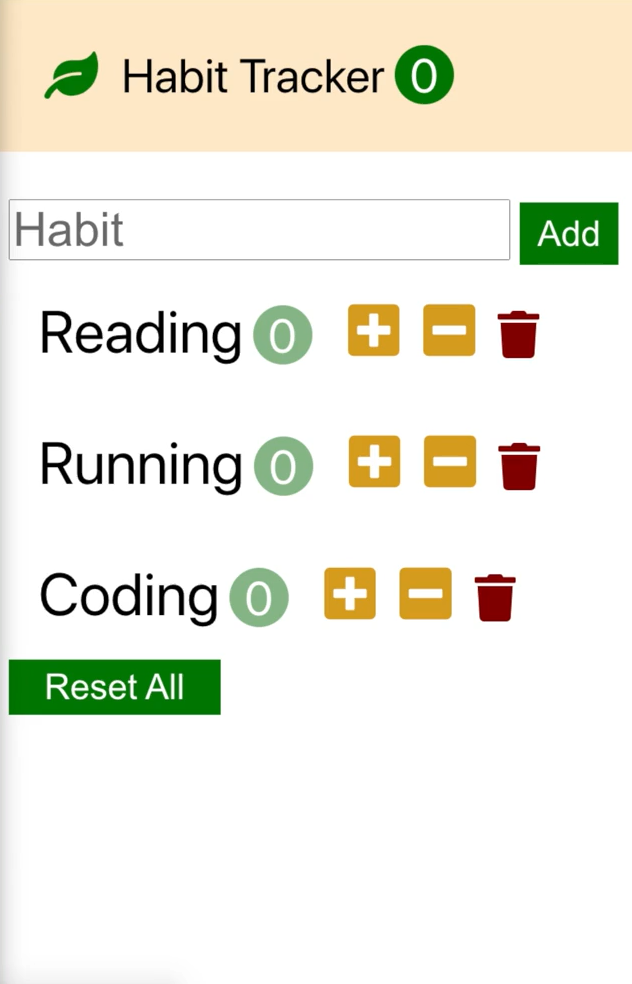

#### 7-2. The one list of habit tracker

- Use `ReactDOM.render()` to display `<App />` on document tab with id named `root`.

- In case of index.jsx,
  `import React from 'react';`
  `import ReactDOM from 'react-dom';`
  `import './index.css';`
  `import App from './app';`
  `import reportWebVitals from './reportWebVitals';`
  `ReactDOM.render`(
  `<React.StrictMode>`
  `<App />`
  `</React.StrictMode>`,
  `document.getElementById('root')`
  );
  `reportWebVitals();`

- Use `return <Habit />;` within `App()` to apply `class Habit` on `app.jsx`. I used `app.css` to decorate styling of list.
- In case of all codes, please refer `src/app.css`.

- In case of app.jsx,
  `import './app.css';`
  `import Habit from './components/habit';`
  `function App()` {
  `return` (
  `<Habit />`
  );
  }
  `export default App;`

- In case you want to save any change and display that, use `state` and `setState()` according to synthetic event. `React` can not recognize changes if not used `setState()` such as `this.state.count ++;`. So, please use `this.setState({count: this.state.count + 1});`. In addition, code block {} should be covered on `count: this.state.count + 1` to display value of count.

- In case of habit.jsx,
  `import React, { Component } from 'react';`
  `import '@fortawesome/fontawesome-free/js/all.js'`
  `class Habit extends Component` {
  `state` = {
  `count: 0`
  };
  `handleIncrement = () => {`
  `this.setState({count: this.state.count + 1});`
  };
  `handleDecrement = () => {`
  `const count = this.state.count - 1;`
  `this.setState({count: count < 0 ? 0 : count});`
  };
  `render()` {
  `return`(
  `<li className="habit">`
  `Reading`
  `0`
  `<button className="habit-button habit-increase" onClick={this.handleIncrement}>`
  `<i className="fa-solid fa-square-plus"></i>`
  `</button>`
  `<button className="habit-button habit-decrease" onClick={this.handleDecrement}>`
  `<i className="fa-solid fa-square-minus"></i>`
  `</button>`
  `<button className="habit-button habit-delete">`
  `<i className="fa-solid fa-trash"></i>`
  `</button>`
  `</li>`
  );
  }
  }
  `export default Habit;`

- In case of semi-output,

- 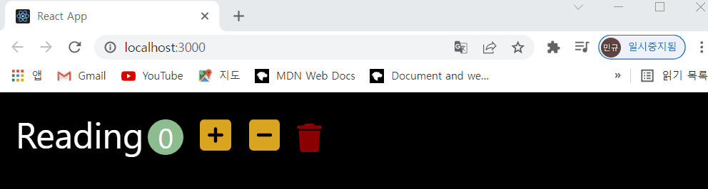

#### 7-3. The list of habits tracker

#### 7-3-1. State and props

- In case you want to get output using `Habit class` within render of `Habits class` and want to use `state` within `Habits class`, please use `props` within `Habit class`. The use of not only `state` but also `props` depends on the situation. First, please use `state` to set up inputs within current class. Second, please use `props` to set up inputs from other class and outside current class. For example, configuring keys and values on `state` in `Habits class`, in case of using the keys and values within render in `Habit class`, please use `const { name, count } = this.props.habit;` within render in `Habit class`. And then, `<Habit habit={habit} />` within render in `Habits class`. In this case, `Habit class` returns output to `Habits class` according to callback. And then, `Habits class` should return the output to browser to display the output correctly on window tab. In addition, `React` recommends to use `id` per key when using list type of input such as array. The warning message would display on console tab if not used `id`.

- In case of habits.jsx,
  `import React, { Component } from 'react';`
  `import Habit from './habit';`
  `class Habits extends Component` {
  `state = {`
  `habits: [`
  `{id: 1, name: 'Reading', count: 0},`
  `{id: 2, name: 'Running', count: 0},`
  `{id: 3, name: 'coding', count: 0}`
  ],
  };
  `render() {`
  `return (`
  `<ul>`
  `{this.state.habits.map(habit => (`
  `<Habit key={habit.id} habit={habit} />`
  ))}
  `</ul>`
  );
  }
  }
  `export default Habits;`

- In case of habit.jsx,
  `import React, { Component } from 'react';`
  `class Habit extends Component` {
  `render()` {
  `const { name, count } = this.props.habit;`
  `return(`
  `<li className="habit">`
  `{name}`
  `{count}`
  `<button className="habit-button habit-increase" onClick={this.handleIncrement}>`
  `<i className="fa-solid fa-square-plus"></i>`
  `</button>`
  `<button className="habit-button habit-decrease" onClick={this.handleDecrement}>`
  `<i className="fa-solid fa-square-minus"></i>`
  `</button>`
  `<button className="habit-button habit-delete" onClick={this.handleDelete}>`
  `<i className="fa-solid fa-trash"></i>`
  `</button>`
  `</li>`
  );
  }
  }
  `export default Habit;`

#### 7-3-2. Processing datas

- Class should prcess the datas within the class itself generally instead of processing the datas on the class. In addition, use other class as roll of coponent offering only callback to display correct output with `React` if it needed.

- `<Habit onIncrement={this.handleIncrement} onDecrement={this.handleDecrement} onDelte={this.handleDelete} />` means to use `onIncrement`, `onDecrement`, `onDelete` as `props` of `Habit class`. Inputs should be applied as props to use functions of `Habits class` on `Habit class`. For example, in case you want to use keys and values of handleIncrement of Habits class using `<Habit onIncrement={this.handleIncrement} />`, `handleIncrement = () => {this.props.onIncrement(this.props.habit)};` should be applied to within `Habit class` according to callback. `this.props.onIncrement` means to use onIncrement as props. `this.props.habit` means to use habit as parameter of onIncrement.

- In case of `this.setState({habits: habits});` on `Habits class`, forward of habits means key of const habits per event. Backward of habits means value of const habits per event. this.setState({habits}) is equal when same name between key and value of const habits per event.

- In case of habits.jsx,
  `class Habits extends Component` {
  `handleIncrement = (habit) => {`
  `const habits = [...this.state.habits];`
  `const index = habits.indexOf(habit);`
  `habits[index].count++;`
  `this.setState({habits: habits});`
  `//habit.count++;`
  `//this.setState(this.state);`
  };
  `handleDecrement = (habit) => {`
  `const habits = [...this.state.habits];`
  `const index = habits.indexOf(habit);`
  `const count = habits[index].count -1;`
  `habits[index].count = count < 0 ? 0 : count;`
  `this.setState({habits});`
  };
  `handleDelete = (habit) => {`
  `const habits = this.state.habits.filter(item => item.id !== habit.id);`
  `this.setState({habits});`
  };
  `render()` {
  `return` (
  `<ul>`
  `{this.state.habits.map(habit => (`
  `<Habit`
  `onIncrement={this.handleIncrement}`
  `onDecrement={this.handleDecrement}`
  `onDelete={this.handleDelete} />`
  ))}
  `</ul>`
  );
  }
  }
  `export default Habits;`

- In case of habit.jsx,
  `class Habit extends Component` {
  `handleIncrement = () => {`
  `this.props.onIncrement(this.props.habit);`
  };
  `handleDecrement = () => {`
  `this.props.onDecrement(this.props.habit);`
  };
  `handleDelete = () => {`
  `this.props.onDelete(this.props.habit);`
  };
  }
  `export default Habit;`

- In case of semi-output,

- 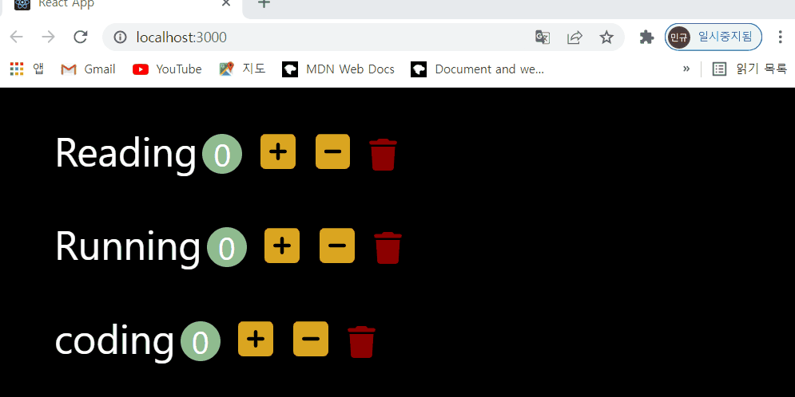

### 8. Resolution of failures

#### 8-1.

- symptom: `npm create react-app test` is installed completely, but I received error message when `npm start` on incorrect path. The incorrect path is `C:\Users\PARK MIN KYU\Downloads\cmder\projects\git\React\basic`. The correct path is `C:\Users\PARK MIN KYU\Downloads\cmder\projects\git\React\basic\test` because `react-app` was installed `test` depository. `package.json` should be needed when react loading. In case of incorrect path, there is no package.json which has `scripts` of start.

- 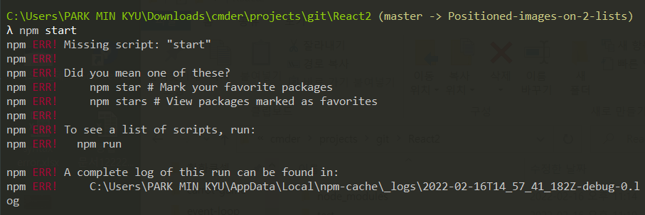

- countermeasure: type `npm start` on correct path : `C:\Users\PARK MIN KYU\Downloads\cmder\projects\git\React\basic\test`.

#### 8-2.

- symptom: `yarn create react-app test1` is not installed with error `commnad failed`. `package.json` can not be created.

- 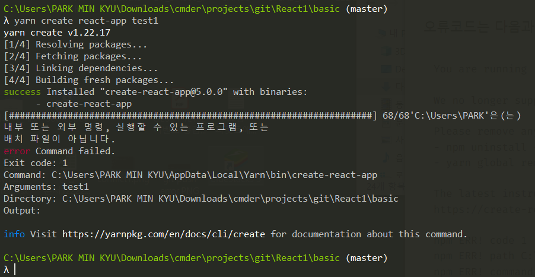

- countermeasure: `yarn create react-app test1` could be divided to `yarn global add create-react-app` and `create-react-app test1`. Please type commands in sequence. And then, type `yarn start` when path of cmder moves to directory named `test1`.

- 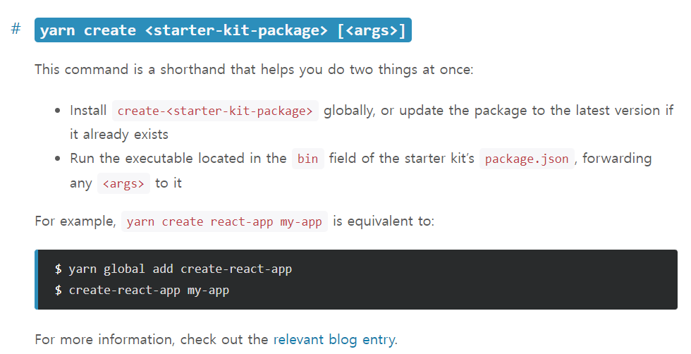

#### 8-3.

- symptom: error message occurred such as `Module not found: Can't resolve path of library` when I deleted `reportWebVitals.js`. `reportWebVitals()` on `index.jsx` could not refer the reference of `reportWebVitals()` on reportWebVital.js.

- countermeasure: restore `reportWebVital.js` on folder named `src` after exiting `React`. And then, `yarn start` once again.

#### 8-4.

- symptom: error message occurred such as `Reading is not defined no-undef`. The value of key should be applied string type.

- 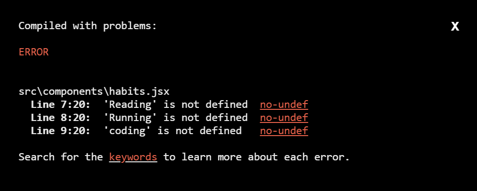

- countermeasure: use `state = {habits: [{id:1, name: 'Reading', count:0}]}` instead of `name: Reading`.

#### 8-5.

- symptom: warning message occurred such as `Each child in a list should have a unique key prop`. In case you use state as array, `React` needs id per key.

- 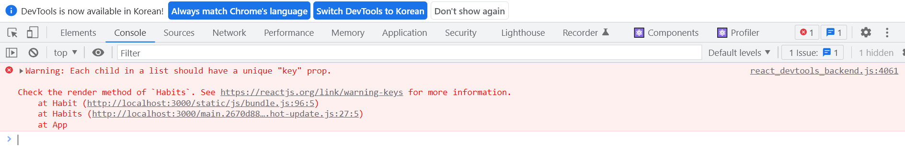

- countermeasure: use unique id on each of objects such as `state = {habits: [{id:1, name: 'Reading', count:0}]}`. And then, use `key={habit.id}` of `<Habit key={habit.id} habit={habit} />` within render on `Habits class`.

#### 8-6.

- symptom: typeError message occurred on console tab such as `Cannot read properties of null (reading: 'habits')` when `state` and `functions` are moved from `Habits class` to `App class`. In addtion, there is no output on window tab. `state` is defined on `app.jsx`. However, I used `this.state.habits.map` of `render(){return({this.state.habits.map(habit => (...) )})}` instead of `this.props.habits.map`.

- 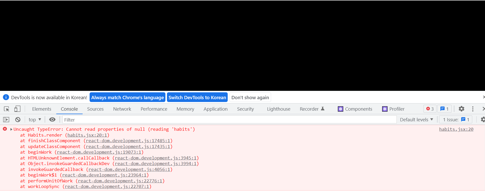

- countermeasure: use `render(){return(this.props.habits.map(habit => (<Habit />)))}` instead of `this.state.habits.map`.
